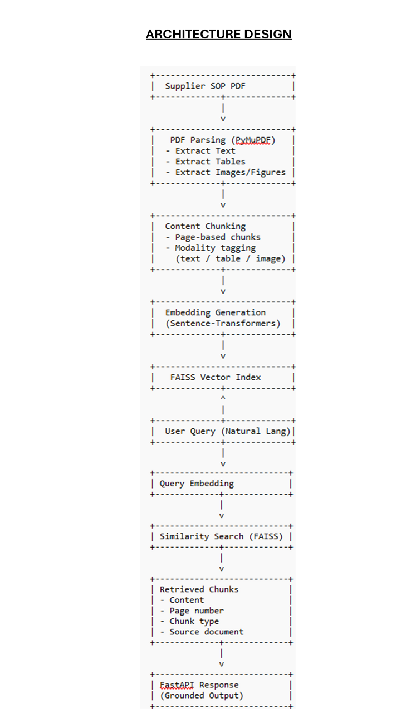
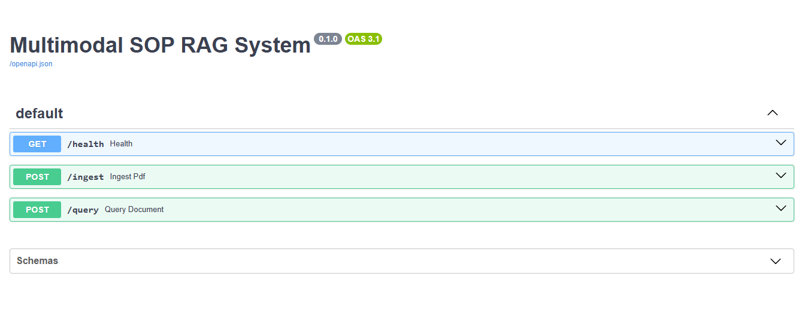
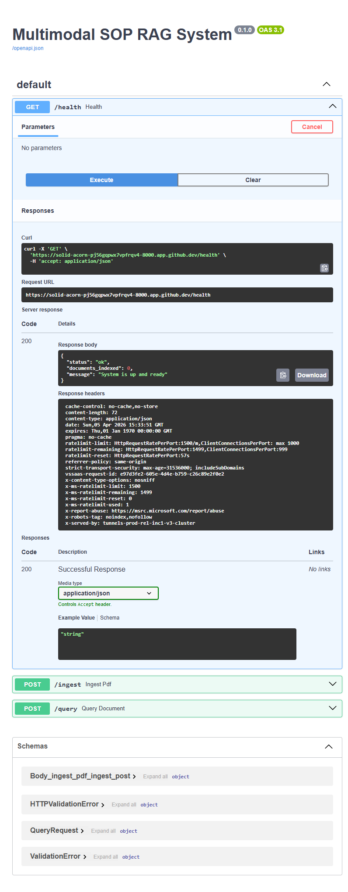
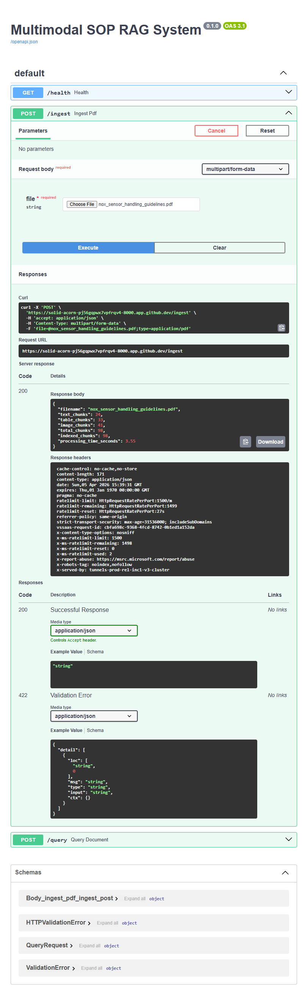
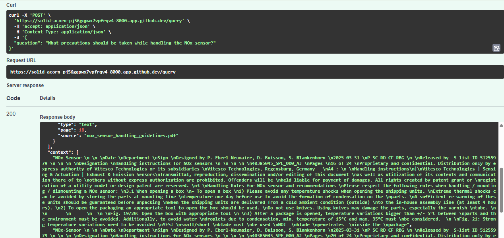
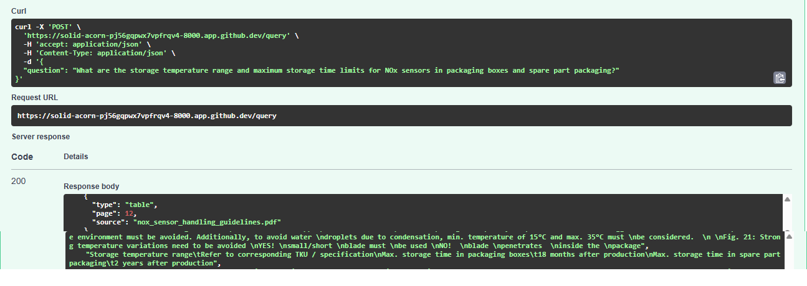
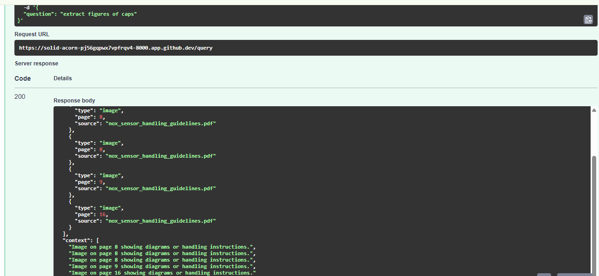

# Multimodal RAG System for Technical SOP Documents

---

## 1. Problem Statement

### Domain Identification

This project is positioned within the domain of automotive manufacturing, supply chain operations, supplier quality, and OEM–supplier collaboration, where complex vehicle systems are developed through tightly coupled partnerships between Original Equipment Manufacturers (OEMs) and Tier‑1 or Tier‑2 suppliers. In modern vehicle programs, a significant portion of safety‑critical, emission‑related, and electronically controlled components—such as sensors, actuators, and control modules—are designed, validated, and owned by suppliers, while OEMs are responsible for system integration, production, logistics, field service, and warranty management.

Due to this distributed ownership of design and intellectual property, OEM organizations depend extensively on supplier‑provided technical manuals and Standard Operating Procedures (SOPs) to govern handling, storage, assembly, disassembly, servicing, and troubleshooting of such proprietary parts.

---

### Problem Description

Supplier‑owned components are accompanied by detailed operational manuals that define the authoritative rules under which the component must be handled throughout its lifecycle. These manuals are typically delivered as PDF documents and contain a mixture of narrative instructions, structured tables, warnings, constraints, and visual illustrations. They explicitly define acceptable handling conditions, numerical limits, tooling requirements, environmental constraints, and conditions under which supplier warranty obligations remain valid.

In OEM environments, these documents are consumed by diverse user groups such as manufacturing operators, quality engineers, warehouse personnel, service technicians, and supplier quality teams. These users frequently need quick, precise answers while working under time pressure on the shop floor, in warehouses, or during vehicle servicing. However, extracting actionable information from such manuals is difficult in practice. Relevant details may be buried deep within the document, expressed only in tables, or communicated through diagrams and symbols rather than descriptive text. Traditional keyword‑based search is therefore insufficient, forcing users to manually scan long documents or rely on informal knowledge, which increases the risk of errors.

Misinterpretation or non‑compliance with supplier manuals can have significant consequences, including part damage, quality escapes, safety concerns, rejected warranty claims, and transfer of responsibility and cost to the OEM.

---

### Why This Problem Is Unique

This problem differs fundamentally from generic document question answering. The manuals involved are externally owned, legally binding, and operationally critical, and OEMs do not have the authority to modify, simplify, or reinterpret their content. The documentation must be followed as‑is, and any deviation can invalidate warranty or compliance obligations.

Additionally, these manuals are inherently multimodal. Procedural text explains intent and context, tables define precise numerical or categorical constraints, and images or symbols illustrate correct and incorrect practices. Correct operational decisions often require combining information across these modalities, for example interpreting a warning symbol in conjunction with a numerical limit defined in a table. An AI system operating in this space must therefore prioritise accuracy, grounding, and traceability over fluency.

---

### Why Retrieval Augmented Generation (RAG) Is the Right Approach

A Retrieval Augmented Generation (RAG) approach is particularly suitable for this use case because it enables answers to be generated directly from retrieved source content, rather than from a model’s generalised or parametric knowledge. This is essential when working with supplier‑owned documentation where precision and traceability are mandatory.

By extracting and embedding text sections, tabular data, and image‑derived summaries into a vector index, a multimodal RAG system can retrieve the most relevant content fragments and generate answers that remain faithfully grounded in supplier‑authored material. Compared to alternatives such as fine‑tuning or manual document search, RAG provides flexibility when documents change, reduces the risk of hallucination, and supports clear citation of source references, which is critical in industrial environments.

---

### Representative Example and Scope

As a representative example, this project applies the approach to a supplier‑provided automotive sensor handling manual, which typifies the kind of proprietary SOPs used by OEMs for handling, service, and troubleshooting of supplier‑owned parts. While the example comes from the automotive domain, the system is intentionally designed as a generalised multimodal Q&A framework applicable to a wide range of supplier manuals across different industrial contexts.

---

### Expected Outcomes

The expected outcome of this project is a multimodal question‑answering system that allows OEM teams to query supplier manuals in natural language and receive accurate, grounded answers with explicit source references. Such a system can reduce operational errors, improve compliance, accelerate decision‑making, and mitigate risk when working with proprietary supplier components, demonstrating the practical value of multimodal RAG in real‑world industrial settings.

---

## 2. Architecture Overview

### High‑Level Pipeline

Supplier SOP PDF  
→ PDF Parsing (text, tables, images)  
→ Content chunking with page‑level metadata  
→ Semantic embeddings for all modalities  
→ Vector indexing using FAISS  
→ Natural‑language query embedding  
→ Similarity search in vector store  
→ Retrieved content returned with source references  

### Architecture Overview

The following diagram illustrates the end‑to‑end architecture of the Multimodal RAG system.

This architecture ensures that queries are answered only using supplier‑authored content, with full traceability to the original document and page.

---

## 3. Technology Choices

PDF Parser (PyMuPDF)
Enables page‑wise extraction of text, table structures, and image metadata from complex technical PDFs.

Embedding Model (Sentence‑Transformers – all‑MiniLM‑L6‑v2)
Provides compact yet semantically rich embeddings suitable for real‑time similarity search.

Vector Store (FAISS)
Enables efficient nearest‑neighbour retrieval across all document modalities.

LLM (Planned, Not Used)
An LLM could be layered to summarise retrieved content or generate concise answers with citations, but was intentionally excluded to preserve strict grounding.

Vision‑Language Model (VLM) (Planned, Not Used)
Images are currently handled via text summaries; future versions could leverage VLMs for deeper diagram understanding.

API Framework (FastAPI)
Chosen for performance, automatic OpenAPI documentation, and easy integration with Pydantic models.

---

## 4. Setup Instructions
Clone Repository
git clone <repository-url>
cd multimodal-rag-sop

Install Dependencies
pip install -r requirements.txt

Run the Server
python -m uvicorn main:app --reload --host 0.0.0.0 --port 8000

Open Swagger UI
http://localhost:8000/

---

## 5. API Documentation
GET /health
Returns system status and indexed chunk count.
POST /ingest
Uploads a PDF and indexes text, tables, and images.
POST /query
Performs semantic retrieval with grounded references.

---

## 6. Screenshots

### Swagger UI

The Swagger UI below shows all available API endpoints.

### Health Endpoint

The `/health` endpoint confirms that the system is running correctly and reports the number of indexed document chunks.

### Successful PDF Ingestion

This screenshot shows a successful `POST /ingest` request with a multimodal SOP PDF and the corresponding response.

### Text‑Based Query

The following query retrieves text‑based information from the SOP document with page‑level grounding.

### Table‑Based Query

This query retrieves information originally stored in tables, including numerical thresholds and limits.

### Image‑Based Query

This query retrieves image‑summary chunks derived from figures and diagrams in the SOP document.

### Text-based Query

---

## 7. Limitation and Future work
The current system focuses on strict grounding and traceability and therefore has some limitations. Visual content such as diagrams and symbols is indexed only as references, without semantic interpretation, requiring users to manually inspect images. Retrieval is primarily text‑driven; although tables are preserved and retrievable, advanced numerical reasoning or cross‑table validation is not supported. To avoid hallucination, no generative synthesis is applied, which can lead to fragmented responses when information spans multiple sections. Additionally, the system assumes a single‑document context and lacks enterprise‑grade governance features such as audit logs or access control.

Future work includes integrating vision‑language models for true diagram understanding, adding a controlled LLM layer for concise, citation‑based answer synthesis, enabling table‑aware reasoning, supporting multi‑document retrieval with provenance tracking, and introducing compliance‑oriented features required for production OEM environments.

---

## 8. Conclusion
This project demonstrates a complete, grounded, and explainable multimodal RAG system for querying supplier‑owned technical SOP documents, with strong alignment to real‑world OEM operational requirements.

---
